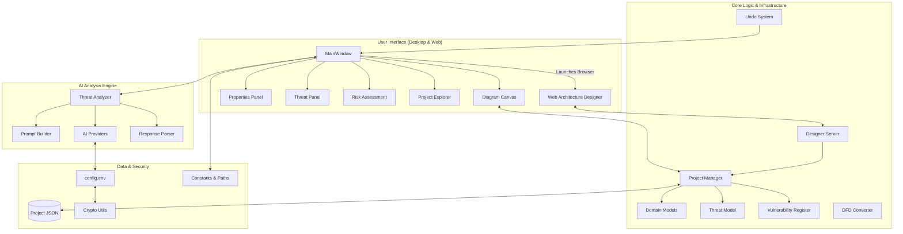

# ThreatPilot Architecture Overview

ThreatPilot is an advanced AI-driven threat modeling application designed to help security engineers and architects analyze systems based on data flow diagrams (DFDs). It uses Large Language Models (LLMs) to automatically identify threats following the STRIDE methodology and prioritize them using risk assessment frameworks.

---

## High-Level System Architecture

The application follows a modular, layered architecture that separates presentation (UI) from core logic and AI integration.

---

## Core Layers and Components

### 1. User Interface (UI) Layer
The UI is built using Python and PySide6, providing a desktop-native experience for complex modeling tasks.
- **MainWindow**: The central hub orchestrating layout, menus, and global state transitions.
- **Diagram Canvas**: A specialized component for drawing and interacting with DFD elements.
- **Properties Panel**: A context-aware side dock for editing attributes. Features drag-resizing (260px - 800px) and fully selectable, copyable text container layouts.
- **Threat Panel**: A tabular view of all identified threats with filtering controls.
- **Risk Assessment Suite**: Includes interactive CVSS 3.1 calculators and a Risk Matrix visualization.

### 2. Core Engine
Handles the underlying logic of threat modeling and state management.
- **Domain Models**: Pydantic-based schemas for architectural elements (Entity, Process, Data Store, Flow).
- **Threat Model**: Implements both **STRIDE** (Security) and **LINDDUN** (Privacy) categorization, CVSS 3.1 scoring, and **MITRE ATT&CK** technique mapping. Now includes dedicated tracking for **CVSS Modification Rationales**.
- **Vulnerability Register**: A global repository of identified security flaws. Decouples technical vulnerabilities from high-level threats for standardized remediation tracking.
- **Project Manager**: Orchestrates project lifecycles using a **Multi-File Persistence** strategy (partitioning data into specialized JSON sidecars).
- **Undo System**: Uses `QUndoStack` for multi-action undo/redo capabilities.

### 3. Web Architecture Designer Layer
An alternative interactive workspace built as a React Single Page Application (SPA) (`f:/ThreatPilot/designer`) and integrated via a standard library web server.
- **Designer Server (`designer_server.py`)**: A multi-threaded HTTP/HTTPS server built on Python's native `http.server`. Hosts the frontend assets and exposes REST endpoints.
- **React Flow Canvas**: A modern interactive canvas using Tailwind CSS with full support for light/dark themes, trust boundary nesting, and instant file sync. Component nodes render dynamic, pulsing red badges showing active threat counts.
- **Workspace Screenshot Capture**: Dynamically imports `html-to-image` at runtime, serializes the viewport, downloads the JPEG client-side, and POSTs it to the backend.
- **Validation & Export Panels**: Generates real-time structural warnings, ASCII diagram previews, and Mermaid code exports directly in the web UI.
- **Network Sharing & Advanced Security**: 
  - Allows toggling "Host Architecture Workspace" between local-only and shared modes. 
  - **Shared Mode**: The server binds to `0.0.0.0` and enforces strict authentication via a generated **8-Digit PIN**. Access requires validation through a `/auth` portal which issues a cryptographically secure (`HttpOnly`, `SameSite=Strict`) `threatpilot_session` cookie. 
  - **TLS Encrytpion**: Traffic can optionally be secured via self-signed TLS certificates directly from the UI.
  - **Session Revocation**: The SPA actively polls for connectivity. If sharing is stopped (or restarted), the backend flushes sessions, and the frontend instantly forces a page reload upon receiving `401 Unauthorized` or network errors, locking the screen and wiping lingering memory.
- **Manual Data Entry & Modeling Control**: Comprehensive modals (Add Threat, Add Risk, Add Vulnerability, Add Mitigation) allow full manual overrides, including CVSS scoring rationale justification, with real-time CVSS calculators inside the browser.

### 4. AI Analysis Engine
A sophisticated pipeline transforming architectural diagrams into structured security insights.
- **Threat Analyzer**: The primary orchestrator that segments large architectures to fit within LLM context windows. Integrates the **XAI Reasoning engine** across all tables (Threats, Vulnerabilities, and Mitigation Requirements).
- **Vulnerability & Mitigation XAI**: Implements dynamic prompt construction and async analysis. Reports are parsed and rendered via a dedicated client-side markdown formatter.
- **Vulnerability Registry Fallbacks**: If a vulnerability has no description, it dynamically falls back to its parent threat's mitigation description.
- **Asset Mapping & Deduplication**: Risk Assessment tables dynamically inspect DFD edges (data flows) to map carried assets back to components.
- **AI Providers**: Pluggable interfaces for Google Gemini and Ollama.
- **Prompt Builder & Parser**: Multi-shot, instructional prompts paired with resilient partial-JSON recovery parsing.

### 5. Security & Data
- **Project Files**: Projects are stored as structured JSON files, separating threats, vulnerabilities, mitigations, and layouts.
- **Credential Storage**: API keys are encrypted using Fernet (AES-128-CBC) and stored in `config.env`.
- **Key Management**: Uses PBKDF2 (100,000 iterations) for master key derivation.

---

## Technology Stack

| Component | Technology |
| :--- | :--- |
| **Language** | Python 3.11+ |
| **GUI Framework** | PySide6 (Qt 6) |
| **Data Validation** | Pydantic v2 |
| **AI Integration** | Custom HTTPX-based providers (Gemini, Ollama) |
| **Encryption** | Cryptography.io (Fernet, PBKDF2) |
| **Export Formats** | Excel (OpenPyXL), Markdown, Diagram Images |

---

## Core Workflows

### AI Analysis Pipeline
1. **Extraction**: `DFDConverter` scans the Diagram Canvas and converts visual nodes/edges into a textual DFD representation.
2. **Segmentation**: If the architecture is complex, `ThreatAnalyzer` splits it into logical clusters.
3. **Execution**: The `PromptBuilder` sends the system context and DFD data to the configured `AIProvider`.
4. **Normalization**: `ResponseParser` cleans the raw AI text and maps it to the `Threat` model.
5. **Sync**: The `MainWindow` updates the `Threat Register` and refreshes the UI.

### Project Persistence
- **State Serialization**: All project states are serialized into structured JSON.
- **Data Partitioning**: Uses a sidecar file strategy to prevent data bloat and ensure Git-friendly diffs. Core metadata resides in `project.json`, while technical data is stored in specialized sidecars.
- **Persistence Integrity**: `ProjectManager` ensures that manual overrides to AI-generated threats are preserved during re-analysis.

---

## Web Designer REST API Endpoints

The local visual designer interacts with the desktop application backend through the following local HTTP/HTTPS server routes:

### 1. Project Management
*   **`GET /api/project`**: Loads the active project. Merges and formats data from `project.json`, `architecture.json`, `threats.json`, `vulnerabilities.json`, and `mitigations.json` sidecar files into a unified JSON workspace.
*   **`GET /api/project/metadata`**: Retrieves lightweight project metadata (project path, timestamps) used for fast background polling.
*   **`POST /api/project`**: Saves current diagrams, components, boundaries, custom component types, threats, vulnerabilities, and mitigations back to the project files.
*   **`POST /api/project/autosave`**: Performs periodic background auto-saving to prevent loss of editing states.
*   **`POST /api/project/image`**: Accepts base64 encoded JPG data, decodes it, and saves it as `architecture.jpg` in the project directory.

### 2. AI Infrastructure & Orchestration
*   **`GET /api/project/prompt_config`**: Retrieves the active project's business context, risk preferences, and custom AI prompt instructions.
*   **`POST /api/project/prompt_config`**: Saves updates to the project's business context and prompt configuration.
*   **`GET /api/ai/config`**: Retrieves active AI configurations, model names, endpoints, and credentials status.
*   **`POST /api/ai/config`**: Updates and encrypts AI provider credentials and configurations (including caps like `max_tokens`).
*   **`GET /api/ai/ollama/models`**: Automatically fetches a list of locally available models from the Ollama service.
*   **`POST /api/ai/analyze`**: Runs STRIDE/LINDDUN threat analysis against DFD components.
*   **`GET /api/ai/status`**: Polls the real-time progress and status of an ongoing threat analysis batch.
*   **`POST /api/ai/mitigations`**: Initiates a background Map-Reduce review to group, deduplicate, and compile security requirements.
*   **`GET /api/ai/mitigations/status`**: Polls the real-time progress of an ongoing mitigation compilation batch.
*   **`POST /api/ai/reason`**: Triggers Explainable AI (XAI) deep-dives. Accepts a payload specifying `threat_id`, `vulnerability_id`, or `req_id` to generate targeted technical reports.

### 3. Authentication & Security
*   **`GET /auth`**: Serves the standalone HTML portal for entering the PIN when network sharing is active.
*   **`POST /api/auth/verify`**: Validates the user-submitted PIN and issues a secure `threatpilot_session` cookie if correct.

### 4. Exports
*   **`GET /api/export/html`**: Generates and downloads a complete interactive HTML report of the threat model.
*   **`GET /api/export/excel`**: Generates and downloads the standard 7-tab Excel GRC workbook.
*   **`GET /api/export/checklist`**: Retrieves mitigation requirements formatted as a raw markdown checklist.
*   **`GET /api/export/checklist_excel`**: Renders and downloads a consolidated Excel workbook specifically focused on security mitigation checklists.
