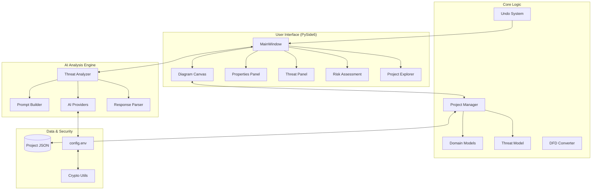

# ThreatPilot Architecture Overview

ThreatPilot is an advanced AI-driven threat modeling application designed to help security engineers and architects analyze systems based on data flow diagrams (DFDs). It uses Large Language Models (LLMs) to automatically identify threats following the STRIDE methodology and prioritize them using risk assessment frameworks.

---

## 🏗️ High-Level System Architecture

The application follows a modular, layered architecture that separates presentation (UI) from core logic and AI integration.

---

## 📦 Core Layers and Components

### 1. User Interface (UI) Layer
The UI is built using Python and PySide6, providing a desktop-native experience for complex modeling tasks.
- **MainWindow**: The central hub that orchestrates the layout, menus, and global state transitions.
- **Diagram Canvas**: A specialized component for drawing and interacting with DFD elements (Components, Flows, Trust Boundaries).
- **Properties Panel**: A context-aware side dock for editing attributes of selected architectural elements.
- **Threat Panel**: A tabular view of all identified threats with filtering and prioritization controls.
- **Risk Assessment Suite**: Includes interactive CVSS 3.1 calculators and a Risk Matrix visualization for severity analysis.

### 2. Core Engine
Handles the underlying logic of threat modeling and state management.
- **Domain Models**: Pydantic-based schemas for architectural elements (Entity, Process, Data Store, Flow).
- **Threat Model**: Implements the STRIDE categorization and CVSS 3.1 scoring logic.
- **Project Manager**: Handles lifecycle of `.project.json` files, ensuring data persistence and integrity.
- **Undo System**: Uses `QUndoStack` for multi-action undo/redo capabilities.

### 3. AI Analysis Engine
A sophisticated pipeline that transforms architectural diagrams into structured security insights.
- **Threat Analyzer**: The primary orchestrator that segments large architectures to fit within LLM context windows.
- **AI Providers**: Pluggable interfaces for multiple backends:
    - **Google Gemini**: Secure integration using the `x-goog-api-key` header for enhanced privacy.
    - **Ollama**: Local AI execution for offline or private analysis (Supports Vision models like Qwen2.5-VL).
- **Prompt Builder**: Dynamically builds multi-shot, instructional prompts containing DFD context, security posture, and strict output requirements, with metadata sanitization to prevent injection.
- **Response Parser**: A resilient parser with partial-JSON recovery logic to extract structured threats even from truncated or imperfect LLM outputs.

### 4. Security & Data
- **Project Files**: Projects are stored as structured JSON files.
- **Credential Storage**: API keys are encrypted using Fernet (AES-128-CBC) and stored in `config.env`.
- **Key Management**: Uses PBKDF2 for key derivation, supporting both OS `keyring` and session-based environment variables for encryption.

---

## 🛠️ Technology Stack

| Component | Technology |
| :--- | :--- |
| **Language** | Python 3.11+ |
| **GUI Framework** | PySide6 (Qt 6) |
| **Data Validation** | Pydantic v2 |
| **AI Integration** | Custom HTTPX-based providers (Gemini, Ollama) |
| **Encryption** | Cryptography.io (Fernet, PBKDF2) |
| **Export Formats** | Excel (OpenPyXL), Markdown, Diagram Images |

---

## 🔄 Core Workflows

### AI Analysis Pipeline
1. **Extraction**: `DFDConverter` scans the Diagram Canvas and converts visual nodes/edges into a textual DFD representation.
2. **Segmentation**: If the architecture is complex, `ThreatAnalyzer` splits it into logical clusters.
3. **Execution**: The `PromptBuilder` sends the system context and DFD data to the configured `AIProvider`.
4. **Normalization**: `ResponseParser` cleans the raw AI text and maps it to the `Threat` model.
5. **Sync**: The `MainWindow` updates the `Threat Register` and refreshes the UI.

### Project Persistence
- All states are serialized into JSON.
- `ProjectManager` ensures that manual overrides to AI-generated threats are preserved during re-analysis.
- Delta updates maintain undo/redo consistency during heavy modeling sessions.
