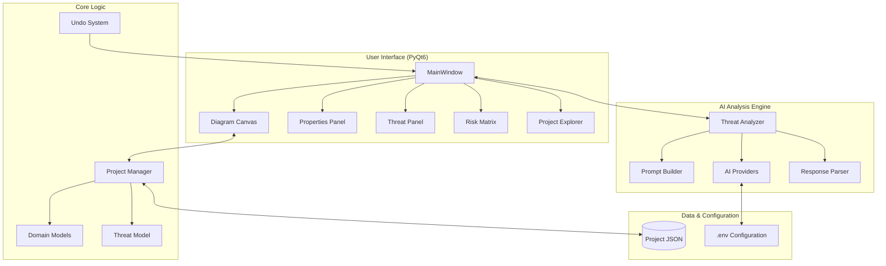

# ThreatPilot Architecture Overview

ThreatPilot is an advanced AI-driven threat modeling application designed to help security engineers and architects analyze systems based on data flow diagrams (DFDs). It uses Large Language Models (LLMs) to automatically identify threats following the STRIDE methodology and prioritize them using risk assessment frameworks.

---

## 🏗️ High-Level System Architecture

The application follows a modular, layered architecture that separates the presentation (UI) from the core logic and AI integration.

---

## 📦 Core Layers and Components

### 1. User Interface (UI) Layer
The UI is built using Python and PyQt/PySide, providing a desktop-native experience for complex modeling tasks.
- **MainWindow**: The central hub that orchestrates the layout, menus, and global state transitions.
- **Diagram Canvas**: A specialized component for drawing and interacting with DFD elements (Components, Flows, Trust Boundaries).
- **Properties Panel**: A context-aware side dock for editing attributes of selected architectural elements.
- **Threat Panel**: A tabular view of all identified threats with filtering and prioritization controls.
- **Risk Assessment Suite**: Includes interactive CVSS 3.1 calculators and a Risk Matrix visualization for severity analysis.

### 2. Core Engine
Handles the underlying logic of threat modeling and state management.
- **Domain Models**: Pydantic-based schemas for architectural elements (Entity, Process, Data Store, Flow).
- **Threat Model**: Implements the STRIDE categorization (Spoofing, Tampering, Repudiation, Information Disclosure, Denial of Service, Elevation of Privilege).
- **Project Manager**: Handles lifecycle of `.threatpilot` project files, ensuring data persistence and integrity.
- **Undo System**: Uses `QUndoStack` to provide robust multi-action undo/redo capabilities for all modeling activities.

### 3. AI Analysis Engine
A sophisticated pipeline that transforms architectural diagrams into structured security insights.
- **Threat Analyzer**: The primary orchestrator that segments large architectures to fit within LLM context windows.
- **AI Providers**: Pluggable interfaces for multiple backends:
    - **Google Gemini**: Native integration with v1 and v1beta versions.
    - **Ollama**: Local AI execution for offline or private analysis.
- **Prompt Builder**: Dynamically builds multi-shot, instructional prompts containing DFD context, security standards, and strict output requirements.
- **Response Parser**: A resilient parser with partial-JSON recovery logic to extract structured threats even from truncated or imperfect LLM outputs.

### 4. configuration & Data
- **Project Files**: Projects are stored as single JSON files containing architectural metadata and the full threat register.
- **Environment Management**: Secrets and API keys are stored in a centralized `config.env` file using `python-dotenv`, decoupled from project-specific data.

---

## 🛠️ Technology Stack

| Component | Technology |
| :--- | :--- |
| **Language** | Python 3.10+ |
| **GUI Framework** | PyQt6 / PySide6 |
| **Data Validation** | Pydantic v2 |
| **AI Integration** | Google Generative AI, Anthropic SDK |
| **Environment** | python-dotenv |
| **Export Formats** | Excel (XLSX), Reports (Markdown/PDF) |

---

## 🔄 Core Workflows

### AI Analysis Pipeline
1. **Extraction**: `DFDConverter` scans the Diagram Canvas and converts visual nodes/edges into a textual DFD representation.
2. **Segmentation**: If the architecture is complex, `ThreatAnalyzer` splits it into logical clusters.
3. **Execution**: The `PromptBuilder` sends the system context and DFD data to the configured `AIProvider`.
4. **Normalization**: `ResponseParser` cleans the raw AI text and maps it to the `Threat` model.
5. **Sync**: The `MainWindow` updates the `Threat Register` and refreshes the UI.

### Project Persistence
- All states are serialized into JSON.
- `ProjectManager` ensures that manual overrides to AI-generated threats are preserved during re-analysis.
- Delta updates maintain undo/redo consistency during heavy modeling sessions.
